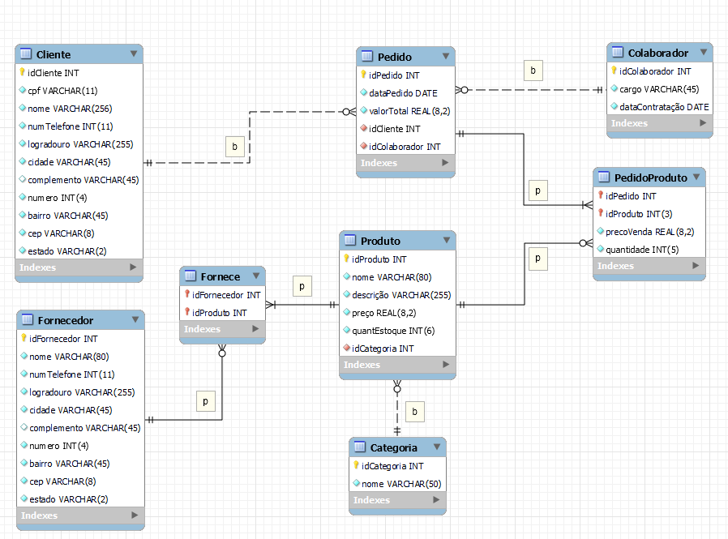

# trabalho-pratico-isbd

Este é um projeto sobre gerenciamento interno de uma loja utilizando PHP e MySQL. O projeto inclui a criação de tabelas, exemplos de consultas SQL, inserção de dados e alterações nas estruturas de tabelas.

## Iniciando o servidor com Docker

```shell
docker compose up -d
```

- O aplicativo estará rodando em <http://localhost:8000>
- O banco de dados MySQL estará rodando em <http://localhost:8080>

## Sobre o SQL
- Temos um arquivo `db/loja.sql` em que temos toda a informação crucial do banco de dados.
- Utilizamos o forward-engineering do MySQL para gerar as tabelas a partir da seguinte modelagem:


- 
